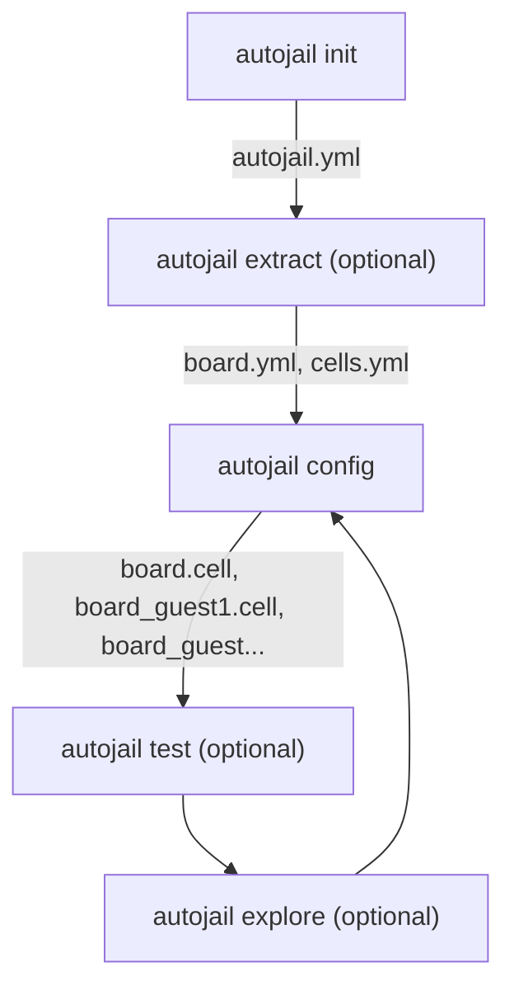
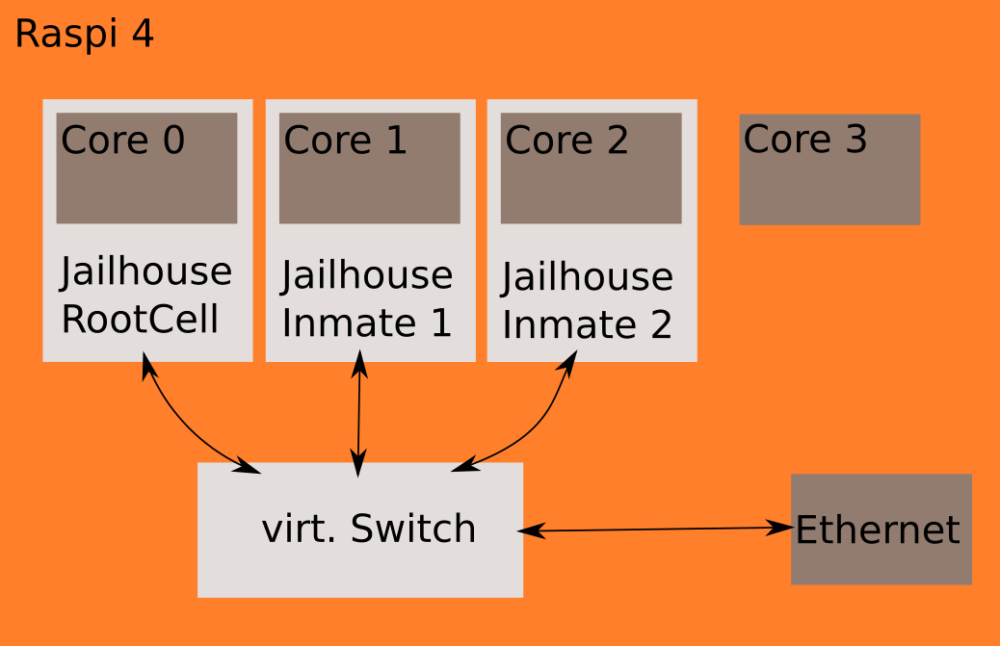

# Übersicht Autojailhouse 

## Flow



### autojail init

Initialisiert ein autojailhouse Projekt.

Eingaben:

- Kernel build directory
- Jailhouse git url
- Cross compiler
- Base architure (ARM oder ARM64)
- Board identifier oder ssh login      

Ausgaben: Projektkonfiguration  (autojail.yml)

### autojail extract
   
Eingaben: autojail.yml

Ausgaben: board.yml

Datenquellen:

- Device trees
- /proc
    * /iomem
    * ..
- Linux tools
    * lscpu
    * lspci
    * lshw
    * ...
- Optional
    * Microbenchmarks
    * Datenblätter [Google Dialogflow](https://ieeexplore.ieee.org/document/8876925)


#### Beispiel 

Beispiel für Rohdaten/Plattformparameter in boards.yml:

```yaml
console: # Wird das hier benötigt (vermutlich nicht)

irqchips:
  gic: 
	address: 0x03881000
	pin_base: 32
	pin_bitmap: 0-128

memory_regions:
  uart:
	virt_start: 0x03020000 #
	phys_start: 0x03020000 # 
	size: 100 MB		   # 
	type: PLL01			   # Wird auf jeden Fall benötigt wenn wir auf Console Eintrag verzichten
	linux_driver: ??	   # Braucht man das ?
	devicetree_nodes: ??   # Braucht man das ?
	root_used: true		   # Wird dieses Device / diese Memory Region vom Linux benutzt, wird benutzt um JAILHOUSE_MEM_ROOTSHARED zu inferieren 
 # evtl. möchte man subregions / subdevices zulassen

 system_ram:
	virt_start: 
	 ...
```	  

### autojail config

Eingaben: board.yml, cells.yml, autojail.yml

- Beschreibung der Zellen: cells.yml
    * Manuell erzeugt
    * Enhält sämtliche nicht herleitbaren Informationen
    * Benötigte CPUs, Memory regions, ...

Ausgaben: Konfiguriertes und gebautes Jailhouse Projekt
  - jailhouse/configs/arch/project.cell
  - jailhouse/configs/arch/project-inmate1.cell
  - ...

#### Beispiel

Minimale cells.yml:

```yaml
root:
  name: "My Root Cell"
  
guests:
  guest1: 
	name: "Guest 1"
 os: bare
 cpus: 1
 console: &root.console	 #Implies | MEM_ROOTSHARED

  guest2:
	name: "Guest 2"
	os: Linux
 cpus: 2,3
 console: &board.mem_regions_pll1.01
 
 mem_regions:
	 memory: 
		size: 128 MB
		virtual_start: 0x0
	 
shmem:
   name: "Shared memory for communication between guest1 und guest2"
   size: 10 MB
   protocol: IVETH
   peers: [guest1, guest2]
```

cells.yml ohne extraktion einer boards.yml ist eine etwas vereinfachte Konfiguration:


```yaml
root:
  name: "Root Cell"
  console: 
	address: 0x3100000
 size: 0x10000,
	type: 8250,
	flags: [ACCESS_MMIO, REGDIST_4]
  platform_info:
	gicd_base: 0x03881000
	gicc_base: 0x03882000
	gich_base: 0x03884000
	gicv_base: 0x03886000
	gic_version: 2
	maintenance_irq: 25
 
  mem_regions:
	timer: 
   phys_start: 0x03020000
	  virt_start: 0x03020000
	  size: 0xa0000
	  flags: [MEM_READ, MEM_WRITE, MEM_EXECUTE]
	 
	uart: 
   ...
   
  irqchips:
	 gic: 
	 address: 0x03881000
		pin_base: 32
		pin_bitmap: 0-128
	 gic2: 
		address: 0x03881000 # In jetson tx2 same pin base is this actually correct
	 pin_base: 160
	 pin_bitmap: 0-128
```


#### Ansätze zur Generierung von 

Regelbasierter Ansatz:

- Auf Basis bestehender Jailhouse Konfigurationen
- Identifikation und Berücksichtigung von Metainformationen
- Feedbackmechanismus
    * Zur Erzeugung optimierter Konfigurationen
    * Regelbasiert

Maschinelles Lernen/Hybridverfahren (siehe autojail explore):

- Generierung von Konfigurationen mittels regelbasiertem Ansatz
- Supervised learning mittels Feedbackmechanismus


### autojail test

Eingaben: Jailhouse.yml generiertes jailhouse projekt
Ausgaben: test_results.yml Success / Fail + evtl. Performance Metriken (Latency/Throughput)
          

Startet jailhouse auf Board in der gewählten Konfigurationen. 
Und führt eine oder mehrere Test-Applikationen aus. 

### autojail explore

Eingaben: autojail.yml und test_results.yml
Ausgaben: Neue cells.yml 

## Use Case / Anwendung:

Hier mal die Anforderungsdefinition von Andreas Messerschmid:
 


    ich hatte Ihnen ja noch einen ersten Vorschlag für einen Usecase mit dem
    Raspi 4 und Jailhouse versprochen. Im Anhang finden Sie ein kleines
    Schaubild dazu. Viele Boards (auch im Bereich unserer Industriekunden)
    verfügen nur über ein physikalisches Netzwerkinterface. Beim Einsatz von
    Jailhouse und der Implementierung von einem oder mehreren Gastsystemen,
    ergibt sich immer wieder die Anforderung, dass zum einen die isolierten
    Jailhouse-Zellen untereinander kommunizieren müssen und darüber hinaus
    evtl. auch mit der Aussenwelt über nur ein physikalisch vorhandenes
    Netzwerkinterface. Daher wäre meine Idee in einem ersten Schritt solch
    ein Szenario mit Jailhouse abzubilden. Die Zielsetzung wäre hierbei
    herauszufinden, welche Konfigurationsschritte dafür notwendig sind und
    erste Ideen zu erarbeiten, wie solch einen Konfiguration automatisiert
    erstellt werden kann.


### Codesys Demonstrator (Möglicherweise Bearbeitung durch Bachelorarbeiter ab April)

Als konkrete Anwendung bereitet Linutronix gerade einen Demonstrator für X86 vor. 
Dieser basiert auf 2-Zellen. 
Eine mit einer Software SPS basierend auf  https://www.codesys.com/ und Realtime Linux.
Die zweite Zelle Läuft mit einem "normalen" Linux und stellt die GUI oder Weboberfläche dar.


1. Portierung einer CODESYS SPS Demoapplikation auf Raspberry PI 4B, Das sollte ungefähr so gehen:
https://raspberry-sps.de/codesys-programme-am-raspberry-pi/
2. Aufteilen des Systems mit dem Jailhouse Hypervisor: . Eine Linuxzelle für die WEB-GUI, eine Linuxzelle für die Steuerung, Idealerweise geht das dann schon mit uneserm Auokonfigurator
3. Umstellen der Zelle mit der Steuerung von einem normalen auf einen Realtime Linux-Kernel
4. Messen und bewerten des Echtzeitverhaltens der 3 vorhergehenden Systemkonfigurationen TODO: Bewertung
5. Optimierung von Systemkonfiguration 3 für (noch) besseres Echtzeitverhalten
6. Automatisierung der Installation und Messungen

## Meilenstein Planung Phase 1

### Milestone 1: Minimal Viable Prototype

Features:

1. Minimales *autojail extract*: parst nur /proc/iomem mit hart kodierten
   werten für FLAGS und virtual address
2. Minimales *autojail config*: Generierung von Konfiguration aus im 
   wesentlichen selbst geschriebener cells.yml + teilweise automatisierte 
   generierung von *memory_regions*. 
   
### Milestone 2: First usable Product

Features:

1. *autojail init*: First version
2. *autojail extract*: 
  - Zusätzlich parsen von device trees
    - Extraktion von interrupt controller und interrupts
	- Wenn mögliche der Konsolen-Konfiguration
3. *autojail generate*:
  - Automatische Generierung eines Großteils von
    memory regions, irqchips, platform_info
  - Erste Unterstützung für Konfiguration von Inter-Zell Kommunikation
    
	
### Milestone 3: Abschluss Phase 1

- Integration des Codesys SPS Demonstrators
- Konfiguration eines zweiten Boards
- Dokumentation der Ergebnisse
- Vielleicht Integration / Beispiel für Benutzung mit [ELBE](https://elbe-rfs.org/) 
- Falls sinnvoll/möglich Publikation der Ergebnisse 
- Planung für Phase 2 insbesondere:
  - Entscheidung über *autojail test* und *autojail explore*
  - Entscheidung über Einsatz von Machine Learning
